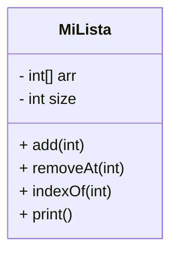

███████╗██╗     ██╗███████╗██╗         ██████╗  █████╗ ██╗██╗
██╔════╝██║     ██║██╔════╝██║         ██╔══██╗██╔══██╗██║██║
█████╗  ██║     ██║█████╗  ██║         ██████╔╝███████║██║██║
██╔══╝  ██║     ██║██╔══╝  ██║         ██╔══██╗██╔══██║██║██║
██║     ███████╗██║██║     ███████╗    ██║  ██║██║  ██║██║███████╗
╚═╝     ╚══════╝╚═╝╚═╝     ╚══════╝    ╚═╝  ╚═╝╚═╝  ╚═╝╚═╝╚══════╝
        ██████╗  █████╗ ██╗██╗██╗ ██████╗
        ██╔══██╗██╔══██╗██║██║██║██╔═══██╗
        ██████╔╝███████║██║██║██║██║   ██║
        ██╔══██╗██╔══██║██║██║██║██║   ██║
        ██║  ██║██║  ██║██║██║██║╚██████╔╝
        ╚═╝  ╚═╝╚═╝  ╚═╝╚═╝╚═╝╚═╝ ╚═════╝

# 🔥 Proyecto: Algoritmos & Lista Dinámica en Java (Estilo Gamer / Cyber)

**Autor:** Eliel David Rodríguez Villalobos  
**Propósito:** Ejercicios de práctica (recuperación B1) — Bubble Sort (conteo de swaps), lista dinámica (removeAt, indexOf) y programa demostrativo con menú.

---

## 📌 Resumen rápido

Este repositorio contiene:

- Implementación de **bubbleSortCountSwaps** (cuenta swaps al ordenar).  
- Clase `MiLista` (arreglo dinámico con `add`, `removeAt`, `indexOf`, `print`).  
- `ProgramaUnico.java` con un **menú interactivo** que demuestra las funciones.  
- Diagramas Mermaid incluidos para visualización en GitHub.

---

## 📂 Estructura sugerida del repo

```
/
├─ ProgramaUnico.java
├─ README.md       <-- este archivo
└─ LICENSE (opcional)
```

---

## 🧠 Diagrama general (Mermaid)

> En GitHub el bloque Mermaid se renderiza automáticamente. Si tu visor no lo soporta, verás el texto plano.

```mermaid
flowchart TD
    A[ProgramaUnico.java] --> B[bubbleSortCountSwaps()]
    A --> C[Clase interna MiLista]
    C --> C1[add()]
    C --> C2[removeAt()]
    C --> C3[indexOf()]
    C --> C4[print()]
    A --> D[main() con pruebas]

    B --> E[Ordenamiento Bubble Sort]
    C2 --> F[Eliminación por índice]
    C3 --> G[Búsqueda lineal]
```

---

## 🔁 1) Bubble Sort — `bubbleSortCountSwaps`

**Firma:**
```java
public static int bubbleSortCountSwaps(int[] arr)
```

**Descripción:**

- Ordena el arreglo de forma ascendente usando Bubble Sort.
- Cuenta y retorna el número de swaps (intercambios) realizados.
- Optimizado para detenerse si ya está ordenado (bandera `cambio`).

**Diagrama del proceso (Mermaid):**

```mermaid
flowchart LR
    A[Inicio] --> B{¿i < n-1?}
    B -->|Sí| C{¿arr[j] > arr[j+1]?}
    C -->|Sí| D[Intercambiar valores]
    D --> E[swaps++]
    C -->|No| F[Siguiente j]
    E --> F
    F --> G{¿Se hicieron cambios?}
    G -->|No| H[Terminar]
    G -->|Sí| I[Siguiente i]
    I --> B
    B -->|No| H
```

---

## 🗂 2) `MiLista` — Lista dinámica (tipo ArrayList casero)

**Características principales:**

- Arreglo interno `int[] arr` con crecimiento automático (doble tamaño).
- Control manual de `size`.
- Métodos: `add`, `removeAt`, `indexOf`, `print`.

**Diagrama de la clase (Mermaid):**



---

### 🗑 `removeAt(int index)`

**Firma:**
```java
public int removeAt(int index)
```

**Comportamiento:**

- Valida `index` (lanza `IndexOutOfBoundsException` si es inválido).
- Guarda el valor a eliminar.
- Mueve todos los elementos posteriores una posición a la izquierda.
- Decrementa `size`.
- Retorna el valor eliminado.

**Diagrama removeAt (Mermaid):**

```mermaid
flowchart TD
    A[removeAt(index)] --> B{index válido?}
    B -->|No| C[throw IndexOutOfBoundsException]
    B -->|Sí| D[Guardar valor eliminado]
    D --> E[Mover elementos a la izquierda]
    E --> F[size--]
    F --> G[Retornar eliminado]
```

---

### 🔎 `indexOf(int value)`

**Firma:**
```java
public int indexOf(int value)
```

- Recorre la lista y devuelve el índice de la primera aparición.
- Devuelve `-1` si no encuentra el valor.

**Diagrama indexOf (Mermaid):**

```mermaid
flowchart TD
    A[indexOf(value)] --> B[Recorrer arreglo]
    B --> C{¿arr[i] == value?}
    C -->|Sí| D[Retornar i]
    C -->|No| E{¿Fin del arreglo?}
    E -->|No| B
    E -->|Sí| F[Retornar -1]
```

---

## 🧾 Menú del programa

El `main` incluye un menú simple para ejecutar las pruebas:

```
===== MENÚ =====
1. bubbleSortCountSwaps
2. removeAt
3. indexOf
0. Salir
```

---

## 💻 Código completo — `ProgramaUnico.java`

> Copia/pega este archivo en tu proyecto:

```java
import java.util.Scanner;

public class ProgramaUnico {

    // ===========================
    // 1. bubbleSortCountSwaps
    // ===========================
    public static int bubbleSortCountSwaps(int[] arr) {
        int swaps = 0;
        boolean cambio;

        for (int i = 0; i < arr.length - 1; i++) {
            cambio = false;
            for (int j = 0; j < arr.length - 1 - i; j++) {
                if (arr[j] > arr[j + 1]) {
                    int temp = arr[j];
                    arr[j] = arr[j + 1];
                    arr[j + 1] = temp;
                    swaps++;
                    cambio = true;
                }
            }
            if (!cambio) break;
        }
        return swaps;
    }

    // ===========================
    // Lista dinámica
    // ===========================
    static class MiLista {
        private int[] arr;
        private int size;

        public MiLista() {
            arr = new int[10];
            size = 0;
        }

        public void add(int value) {
            if (size == arr.length) {
                int[] nuevo = new int[arr.length * 2];
                System.arraycopy(arr, 0, nuevo, 0, arr.length);
                arr = nuevo;
            }
            arr[size++] = value;
        }

        public int removeAt(int index) {
            if (index < 0 || index >= size)
                throw new IndexOutOfBoundsException("Índice inválido: " + index);

            int eliminado = arr[index];

            for (int i = index; i < size - 1; i++)
                arr[i] = arr[i + 1];

            size--;
            return eliminado;
        }

        public int indexOf(int value) {
            for (int i = 0; i < size; i++)
                if (arr[i] == value)
                    return i;
            return -1;
        }

        public void print() {
            for (int i = 0; i < size; i++)
                System.out.print(arr[i] + (i < size - 1 ? ", " : ""));
            System.out.println();
        }
    }

    // ===========================
    // MAIN CON MENÚ
    // ===========================
    public static void main(String[] args) {
        Scanner sc = new Scanner(System.in);
        MiLista lista = new MiLista();
        int opcion;

        do {
            System.out.println("\n===== MENÚ =====");
            System.out.println("1. bubbleSortCountSwaps");
            System.out.println("2. removeAt");
            System.out.println("3. indexOf");
            System.out.println("0. Salir");
            System.out.print("Elige una opción: ");
            opcion = sc.nextInt();

            switch (opcion) {

                case 1:
                    System.out.println("\n--- Prueba bubbleSortCountSwaps ---");
                    int[] datos = {3, 2, 1};
                    int swaps = bubbleSortCountSwaps(datos);

                    System.out.print("Arreglo ordenado: ");
                    for (int n : datos) System.out.print(n + " ");
                    System.out.println("\nSwaps realizados: " + swaps);
                    break;

                case 2:
                    System.out.println("\n--- Prueba removeAt ---");
                    lista = new MiLista();

                    lista.add(3);
                    lista.add(6);
                    lista.add(9);
                    lista.add(12);
                    lista.add(15);

                    int eliminado = lista.removeAt(2);

                    System.out.println("Eliminado: " + eliminado);
                    System.out.print("Lista: ");
                    lista.print();
                    break;

                case 3:
                    System.out.println("\n--- Prueba indexOf ---");
                    lista = new MiLista();

                    lista.add(4);
                    lista.add(8);
                    lista.add(4);
                    lista.add(10);
                    lista.add(4);

                    System.out.println("indexOf(4) = " + lista.indexOf(4));
                    System.out.println("indexOf(10) = " + lista.indexOf(10));
                    System.out.println("indexOf(7) = " + lista.indexOf(7));
                    break;

                case 0:
                    System.out.println("Saliendo...");
                    break;

                default:
                    System.out.println("Opción inválida.");
            }

        } while (opcion != 0);

        sc.close();
    }
}
```

---

## ✅ Ejemplo de salida esperada

```
Arreglo ordenado: 1, 2, 3
Swaps realizados: 3

Eliminado: 9
Lista: 3, 6, 12, 15

indexOf(4) = 0
indexOf(10) = 3
indexOf(7) = -1
```

---

## 📌 Cómo compilar y ejecutar

```bash
javac ProgramaUnico.java
java ProgramaUnico
```

---

## 🛠 Recomendaciones / Mejoras futuras

- Añadir `contains`, `insertAt`, o `clear` a `MiLista`.  
- Implementar pruebas unitarias (JUnit).  
- Separar en múltiples clases/archivos para claridad (`MiLista.java`, `BubbleSort.java`, `Main.java`).  
- Incluir diagramas UML como imágenes (PNG/SVG) en `/docs`.

---

## 📜 Licencia (opcional)

Si quieres, agrego la **licencia MIT** al repositorio. ¿La incluyo?

---

## ☠️ Estilo Hacker — Extras opcionales

Si deseas que convierta este README en una **versión "gamer"** separada (`README.gamer.md`) con más ASCII art, colores HTML (no siempre soportados en GitHub) y secciones estilo terminal, dime y la genero.

---

¿Listo para que lo suba a tu repo (te lo pego en un archivo `README.md`) o quieres que también añada la **LICENSE (MIT)** y algunos badges?
